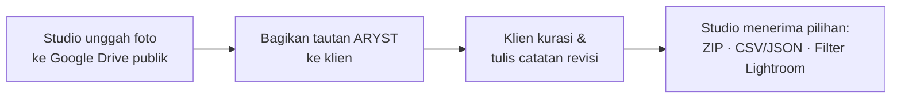

<div align="center">

# ARYST

### Galeri kurasi foto klien, tanpa server

[](https://github.com/miezlearning/aryst_studio/actions)
[](https://miezlearning.github.io/aryst_studio/)


**[Demo Langsung](https://miezlearning.github.io/aryst_studio/)** · **[PRD](./PRD%20Web%20Proofing%20Foto%20GDrive%20%281%29.pdf)** · **[Riwayat Deploy](https://github.com/miezlearning/aryst_studio/actions)**

</div>

ARYST menghubungkan folder **Google Drive publik** milik studio dengan klien lewat satu tautan: klien memilih foto dan menulis catatan revisi langsung di peramban, studio menerima pilihan siap diproses. Tidak ada backend, biaya hosting **$0** di GitHub Pages, dan data tersimpan lokal (IndexedDB).

<div align="center">


</div>

## Fitur

- **Galeri masonry responsif** — rasio asli terjaga, CLS < 0.05, filter *Semua / Terpilih / Belum Dipilih* dan pencarian nama file instan.
- **Lightbox inspeksi** — zoom 100%–600% (klik, scroll, tombol `+`/`−`, cubit di ponsel), geser foto saat zoom, klik area gelap untuk menutup, navigasi keyboard, dan catatan revisi per foto.
- **Seleksi berkuota** — dock mengambang dengan hitungan & progress, kunci seleksi, batas waktu pilihan.
- **Proteksi galeri klien** — klik kanan, seret foto keluar, serta `Ctrl+S`/`Ctrl+P` diblokir di tampilan klien.
- **Serah terima praktis** — unduhan **ZIP** foto pilihan oleh admin, manifest CSV/JSON, salin filter Lightroom, dan kirim via WhatsApp.
- **PWA *offline-first*** — cache Workbox (thumbnail *stale-while-revalidate*, metadata *network-first*), persistensi IndexedDB, indikator jaringan.
- **Aman tanpa server** — CSP deklaratif, sanitasi DOMPurify, anti-clickjacking, tanpa penyimpanan data klien di pihak ketiga.

## Alur Kerja



## Dibangun Dengan

| Lapisan | Teknologi |
| --- | --- |
| Antarmuka | React 19 + TypeScript 5, Tailwind CSS 3 |
| Build & hosting | Vite 6, GitHub Pages + GitHub Actions |
| Penyimpanan | Google Drive API v3, IndexedDB (`idb-keyval`), Zustand |
| PWA | `vite-plugin-pwa` + Workbox |
| Lainnya | `jszip`, `lz-string`, PeerJS, DOMPurify, lucide-react |

## Mulai Cepat

```bash
git clone https://github.com/miezlearning/aryst_studio.git
cd aryst_studio
npm install
npm run dev
```

Buka `http://localhost:5173`. Masuk mode admin dengan **mengklik ganda logo ARYST** di kiri atas, lalu isi PIN admin.

## Konfigurasi Studio

<details>
<summary><b>Folder Drive, API key, dan tautan klien</b></summary>

1. Ubah folder Google Drive menjadi **Anyone with the link can view**.
2. Buat API key di Google Cloud Console (Drive API v3 aktif), lalu simpan lewat tombol pengaturan sesi di dashboard admin.
3. Isi ID folder + API key pada sesi klien, tentukan kuota, lalu **Salin Tautan Klien**.
4. Contoh tautan yang dibagikan ke klien:

```text
https://miezlearning.github.io/aryst_studio/?folder=1AbC...&quota=25&client=Rian%20%26%20Amanda&project=WED-2026-01
```

</details>

<details>
<summary><b>Webhook Google Sheets (opsional)</b></summary>

1. Buat Spreadsheet baru → menu **Extensions → Apps Script**.
2. Salin kode `Code.gs` dari tab *Integrasi* di dashboard ARYST, tempel, simpan.
3. **Deploy → New deployment → Web App**, *Execute as*: Me, *Access*: Anyone.
4. Tempel URL Web App ke kolom Webhook pada sesi klien — pilihan klien masuk otomatis ke Spreadsheet.

</details>

## Deploy

Tidak ada langkah manual: setiap **push ke `master`**, GitHub Actions mengecek tipe, membangun, dan menerbitkan ke

**https://miezlearning.github.io/aryst_studio/**

Pipeline ada di [`.github/workflows/deploy.yml`](./.github/workflows/deploy.yml).

## Struktur Proyek

<details>
<summary>Buka struktur berkas</summary>

```text
aryst_studio/
├── .github/workflows/deploy.yml   # CI/CD → GitHub Pages
├── public/                        # Ikon PWA & aset statis
├── src/
│   ├── components/                # Galeri, lightbox, dock, dashboard admin
│   ├── lib/                       # Drive API, store, sync, zip
│   ├── types/                     # Kontrak tipe TypeScript
│   ├── App.tsx                    # Router tampilan klien & admin
│   └── main.tsx                   # Entry + registrasi service worker
├── index.html                     # CSP + frame-busting
├── vite.config.ts                 # Vite + konfigurasi PWA Workbox
└── package.json
```

</details>
